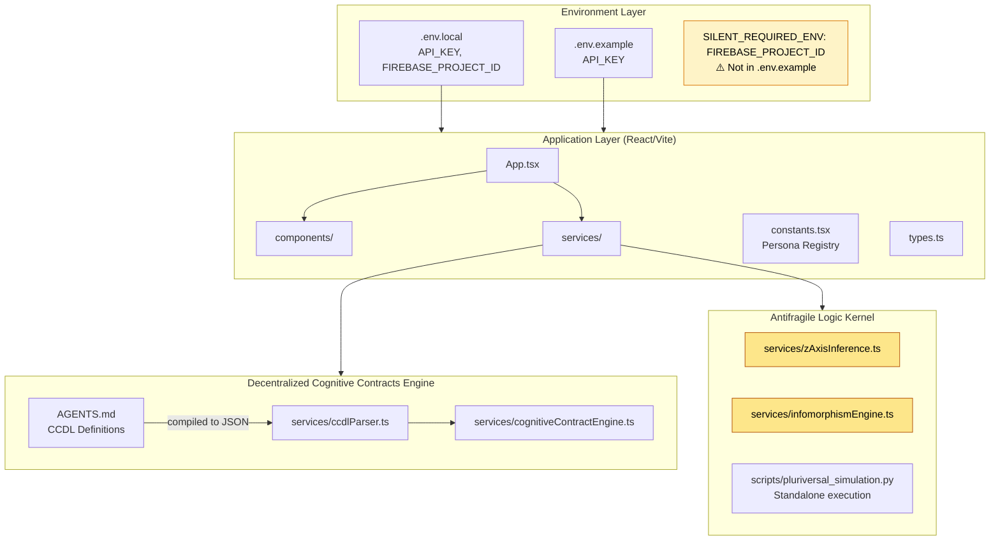
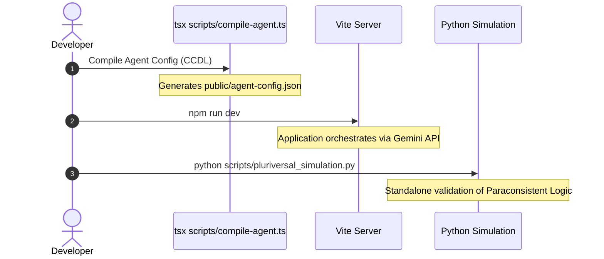

# Architecture AI

> **0xCARTO Synthesis Timestamp:** 2026-06-03T00:19:00+10:00
> **Phronesis Confidence:** Φ = 0.03
> **Ground Truth Score:** GDS = 0.98
> **Undocumented Features Detected:** 2

## What This Repository Is

A multi-agent architectural governance platform executing dialectical synthesis via Gemini API (`@google/genai`). It implements rigorous epistemic engineering, paraconsistent logic (ALK), and a Decentralized Cognitive Contracts Engine (DCCE) to enforce rule-based topological integrity and resolve structural shear between LLM generation and deterministic constraints.

## What This Repository Is NOT

It is not a CI/CD orchestration runner. It does not perform live deployments to AWS/GCP infrastructures. It does not contain unit or integration test suites outside of narrow cognitive contract schema verifications.

---

## Ontological Glossary — Pluriversal Lexicon

> This glossary preserves non-standard naming conventions and local logic structures.
> Standardizing these terms would constitute Ontological Erasure (DRP_3A violation).
> Terms marked [GOLDEN_SCAR] have preserved semantic tension.

| Term | Location | Standard Equivalent | Local Meaning | Preservation Flag |
|---|---|---|---|---|
| `simulateZAxis()` | `services/zAxisInference.ts` | `resolveConflict()` | Applies RCC-8 spatial modeling to compute relational vectors between contradictory constraints without erasing the superposition. | [GOLDEN_SCAR] |
| `+++ContextLock` | `AGENTS.md` | `SYSTEM_PROMPT_PREFIX` | Cognitive Bytecode used to establish permanent semantic anchors against Lost in the Middle bias. | [CULTURAL_ARTIFACT] |
| `infomorphismEngine` | `services/infomorphismEngine.ts` | `feedbackLoop` | Calculates an 'Inverse Safety State' to mathematically integrate human empirical feedback into AI-generated topologies. | [GOLDEN_SCAR] |

## Architecture Topology Map

> Generated via Mycelial CI Trace (DRP_7_PATTERN_MODEL).
> Betti-1 Cycle Status: CLEAN
> Dependency Graph Depth: 4



## CI/CD Pipeline Cartograph

> AST-to-YAML Reverse Trace complete.
> Temporal Flow: Left → Right.
> ⚠️ No active `.github/workflows` found. CI/CD Topology is strictly local scripts.



## Dependency Matrix & Entropy Audit

> Thermodynamic Lens (L3) applied.
> Entropy Score: 0 = deterministic, 1 = fully chaotic.

### Build Reproducibility Index

| Dependency | Version Pin | Production? | CI Invoked? | Entropy Vector |
|---|---|---|---|---|
| `@google/genai` | `1.39.0` (exact pin) | ✅ Yes | ❌ No CI | ✅ LOW |
| `react` | `19.2.4` (exact pin) | ✅ Yes | ❌ No CI | ✅ LOW |
| `tsx` | `4.21.0` (exact pin) | ❌ Dev only | ❌ No CI | ✅ LOW |
| `js-yaml` | `4.1.1` (exact pin) | ✅ Yes | ❌ No CI | ✅ LOW |

### Entropy Score by Layer

| Layer | Score | Primary Source |
|---|---|---|
| Environment | 0.20 | 1 undeclared required ENV var (`FIREBASE_PROJECT_ID`) |
| Application Dependencies | 0.05 | Dependencies are pinned precisely. |
| CI Pipeline | 0.80 | Missing formal CI automation. Local execution reliance. |
| Test Coverage | 0.60 | `scripts/test_cognitive_contracts.ts` exists, but no runner. |
| **Overall Repository Entropy** | **0.41** | **Target: < 0.15** |

## Operational Runbook

### Time-to-Deploy (TTD) Sequence

> **Measured TTD (from commit to production):** N/A (Local Application)
> **Target TTD:** < 3 minutes

#### To Execute Application Locally

1. Validate Environment Variables:
   ```bash
   cat .env.local
   # Ensure API_KEY and FIREBASE_PROJECT_ID are present.
   ```
2. Compile Agent Artifacts:
   ```bash
   npx tsx scripts/compile-agent.ts
   ```
3. Boot Vite Local Server:
   ```bash
   npm run build
   # Serve static
   ```

> ⚠️ **SILENT_REQUIRED_ENV — Set before first deployment:**
> `FIREBASE_PROJECT_ID` — Not in `.env.example`. Required in `AGENTS.md`.

---

## Symbolic Scar Tissue Log — Cultural Artifacts

> Per DRP_7: Golden_Scar_Tension pattern.
> These artifacts are PRESERVED, not standardized.
> Φ-weighting: 1.618 (native logic) vs 1.000 (standard).

### Golden Scar #001: `simulateZAxis()`
- **Location:** `services/zAxisInference.ts`
- **Tension:** Function enforces structural superposition instead of a single resolved boolean truth. Renaming or abstracting this function would erase the core Antifragile Logic Kernel functionality.
- **Recommendation:** Do NOT refactor to a standard conflict resolution algorithm. Maintain `RCC-8` mapping.

### Golden Scar #002: Python `pluriversal_simulation.py` execution
- **Location:** `scripts/pluriversal_simulation.py`
- **Tension:** L5 Paraconsistent State — Python script within a TypeScript React monorepo. It validates structural theories independently of the application layer.
- **Recommendation:** Preserve script. Do not attempt to port purely to TS unless necessary for browser execution, as it models theoretical divergence effectively.
